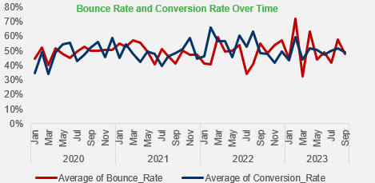
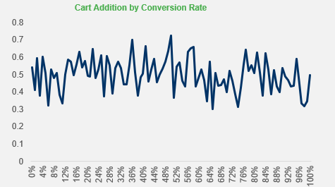
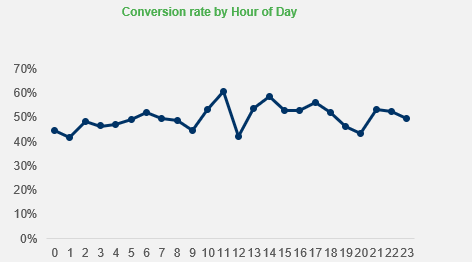
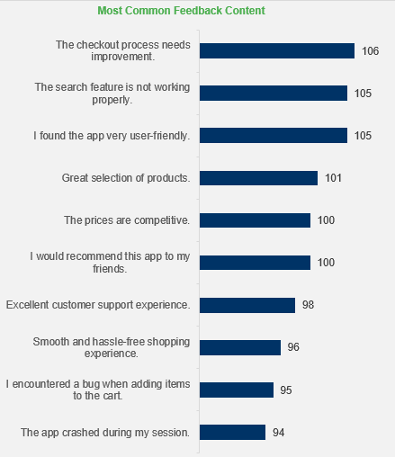

# FlexTrade User Experience Analysis 

## Table of Contents
1. [Overview](#overview)
2. [Project Objective](#project-objective)
3. [Skills Demonstrated](#skills-demonstrated)
4. [Data Source](#data-source)
5. [Tools Used](#tools-used)
6. [Key Findings](#key-findings)
7. [Visualizations](#visualizations)
8. [Recommendations](#recommendations)

## Overview
This analysis evaluates the **user experience of FlexTrade**, focusing on **engagement, conversion trends, and user feedback**. The project identifies major usability challenges and provides actionable solutions to enhance **workflow efficiency, conversion rates, and customer satisfaction**.

## Project Objective
The objective of this project was to analyse **user behaviour, session duration, cart abandonment trends, and feedback** to identify usability issues and propose **data-driven solutions**. The insights derived aim to improve navigation, optimize conversion rates, and increase user engagement.

## Skills Demonstrated
- **Data Cleaning & Transformation**: Processing session data, feedback logs, and cart behaviour.
- **Data Analysis**: Identifying key UX pain points and conversion drop-offs.
- **Data Visualization**: Presenting insights through **pivot tables and dashboards**.
- **Solution Implementation**: Developing recommendations for improving search, checkout, and user retention.

## Data Source
The dataset was derived from:
- **User session analytics** (session duration, bounce rate, cart additions, conversion rate).
- **Customer feedback surveys** (positive vs. negative sentiment analysis).
- **Checkout behaviour data** (purchase funnel tracking).

## Tools Used
- **Microsoft Excel** (for data processing, analysis, and dashboard creation).

## Key Findings
1. **High Bounce Rate (49%)**
   - Users frequently exit the app without making purchases.
   - Pages with high bounce rates include **search results and checkout**.

2. **Cart Abandonment Issues**
   - **51% of users** add products to their cart but do not complete the purchase.
   - **Key reasons:** Unexpected costs, complex checkout process, and lack of trust signals.

3. **Search & Navigation Challenges**
   - **Users struggle with finding products**, leading to frustration and higher drop-offs.
   - The absence of **filters, auto-suggestions, and relevant product recommendations** hinders the experience.

4. **Conversion Rate Insights**
   - **Peak conversion hours:** 10 AM, 11 AM, 1 PM, 2 PM, and 5 PM.
   - Conversion rates increase when promotional campaigns align with peak usage times.

5. **User Feedback Trends**
   - **Negative feedback:** Checkout process complexity and search issues.
   - **Positive feedback:** Easy-to-use interface, competitive pricing, and product variety.

## Visualizations
This analysis includes key data visualizations:

### Dashboard Screenshot

### Bounce Rate vs. Session Duration

### Bounce Rate vs. Conversion Rate

### Cart Abandonment Trends

### Conversion Rate vs. Hour by Day

### User Feedback Sentiment Analysis

## Recommendations
1. **Improve Search & Navigation**
   - Implement **autocomplete, filtering options, and personalized recommendations**.
   - Optimize exit pages by improving content relevance and usability.

2. **Optimize Checkout Process**
   - Simplify the steps required to complete purchases.
   - Introduce **cart reminders and limited-time discounts** to reduce abandonment.

3. **Leverage Peak Conversion Hours**
   - Launch **flash sales and targeted promotions** during peak hours (10 AM–5 PM).
   - Run personalized email campaigns aligned with high engagement periods.

4. **Enhance User Engagement**
   - Introduce **trust-building elements** such as customer testimonials on product pages.
   - Provide loyalty rewards for returning users to boost repeat purchases.

5. **Fix Technical Issues**
   - Address **search inefficiencies** by adding **better indexing and AI-driven recommendations**.
   - Optimize **checkout speed and payment processing** to reduce friction.

---

This project provides a **comprehensive evaluation of FlexTrade’s UX challenges**, delivering **data-backed solutions** to enhance customer experience, increase conversions, and drive business growth.
